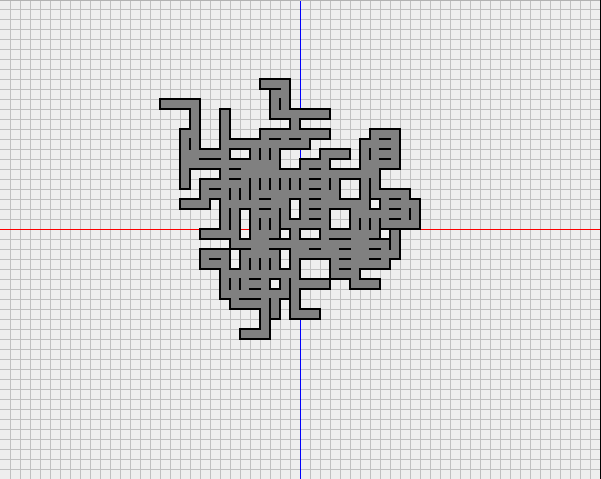

# DunGen
Dun(geon) Gen(erator) - generates a random grid layout for a maze-style dungeon, based on a set of room templates

To build an executable jar-
`./build`

To run- 
`java -jar jar/DunGen.jar`

---

This code generates random dungeon tile layouts, based on a set of templates.  For example templates, see the `data` folder.  Each template is a coordinate-based XML specification of the following form-

```
<rooms>
    <room>
        <tile>
            <x></x>
            <y></y>
            <wall></wall>
```

each 'room' designates a specification for a room, which in turn is made up of tiles.  The tile has an x,y coordinate, which signifies the bottom-left corner of the tile on a cartesian plane.  each room can connect to any other room at any empty space around both room's tiles, assuming both rooms fit into the available space, unless you designate 'walls' for a tile.  Tiles will not connect to each other across a wall.  Up to four walls can be specified, though a room with no available connections will either never be used, or could result in an infinite loop.  Walls are specified as one of the cardinal directions- 

```
<wall>NORTH</wall>
<wall>SOUTH</wall>
<wall>EAST</wall>
<wall>WEST</wall>
```

number of rooms, specification of data file, and use of coloration can all be found in `src/DunGen.java`.

---

### Examples

##### `data/hallways` template, with no coloration


##### `data/generic_rooms` template, with coloration

